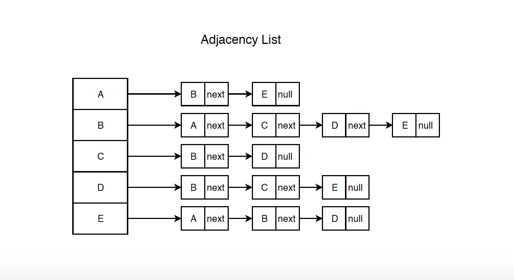
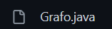
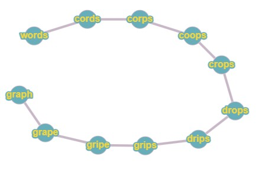
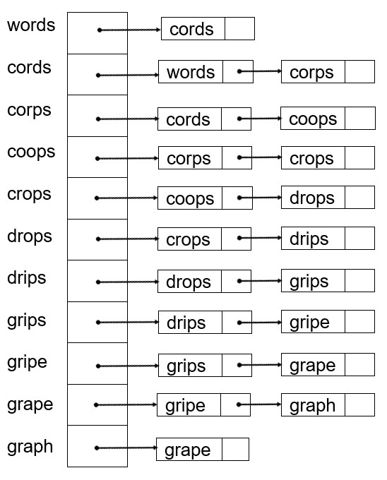
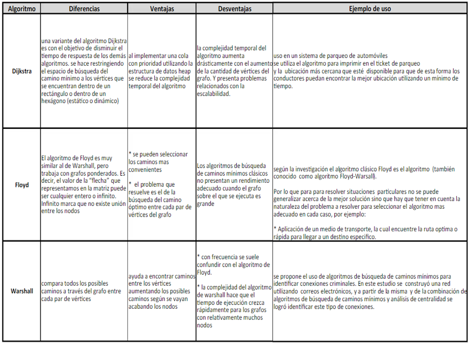

<table>
    <theader>
        <tr>
            <td></td>
            <th>
                UNIVERSIDAD NACIONAL DE SAN AGUSTIN 
                FACULTAD DE INGENIERÍA DE PRODUCCIÓN Y SERVICIOS 
                DEPARTAMENTO ACADÉMICO DE INGENIERÍA DE SISTEMAS E INFORMÁTICA 
                ESCUELA PROFESIONAL DE INGENIERÍA DE SISTEMAS
            </th>
            <td></td>
        </tr>
    </theader>
    <tbody>
        <tr><td colspan="3">Formato: Guía de Práctica de Laboratorio</td></tr>
        <tr><td>Aprobación:  2022/03/01</td><td>Código: GUIA-PRLD-001</td><td>Página: 1</td></tr>
    </tbody>
</table>

GUÍA DE LABORATORIO 

<table>
<theader>
<tr><th colspan="6">INFORMACIÓN BÁSICA</th></tr>
</theader>
<tbody>
<tr><td>ASIGNATURA:</td><td colspan="5">Estructura de Datos y Algoritmos</td></tr>
<tr><td>TÍTULO DE LA PRÁCTICA:</td><td colspan="5">Grafos</td></tr>
<tr>
<td>NÚMERO DE PRÁCTICA:</td><td>08</td><td>AÑO LECTIVO:</td><td>2022 A</td><td>NRO. SEMESTRE:</td><td>III</td>
</tr>
<tr>
<td>FECHA INICIO::</td><td>17-Agosto-2022</td><td>FECHA FIN:</td><td>21-Agosto-2022</td><td>DURACIÓN:</td><td>02 horas</td>
</tr>
<tr><td colspan="6">INTEGRANTES:
    <ul>
        <li>Durand Obando, Eduardo Franshua</li>
        <li>Kevin Jheeremy Alvarez Astete</li>
        <li>Henry Isaias Galvez Quilla</li>
</td>
</<tr>
<tr><td colspan="6">DOCENTES:
<ul>
<li>Richart Smith Escobedo Quispe - rescobedoq@unsa.edu.pe</li>
</ul>
</td>
</<tr>
</tdbody>
</table>

# GRAFOS

[![License][license]][license-file]
[![Downloads][downloads]][releases]
[![Last Commit][last-commit]][releases]

[![Debian][Debian]][debian-site]
[![Git][Git]][git-site]
[![GitHub][GitHub]][github-site]
[![Vim][Vim]][vim-site]
[![Java][Java]][java-site]

#

## OBJETIVOS TEMAS Y COMPETENCIAS

### OBJETIVOS

- Comprender y aplicar los conceptos de grafos

### TEMAS
- Grafos
- Tipos de grafos

## EJERCICIOS PROPUESTOS
#
1. Crear un repositorio en GitHub, donde incluyan la resolucion de los ejercicios
propuestos y el informe.
2. Implementar el cogido de Grafo cuya representacion sea realizada mediante
LISTA DE ADYACENCIA. (3 puntos)
3. Implementar BSF, DFS y Dijkstra con sus respectivos casos de prueba. (5 puntos)
4. Solucionar el siguiente ejercicio: (5 puntos)
El grafo de palabras se define de la siguiente manera: cada vértice es una palabra
en el idioma Inglés y dos palabras son adyacentes si difieren exactamente en una
posición. Por ejemplo, las cords y los corps son adyacentes, mientras que los
corps y crops no lo son.
a) Dibuje el grafo definido por las siguientes palabras: words cords corps coops
crops drops drips grips gripe grape graph
b) Mostrar la lista de adyacencia del grafo.
5. Realizar un metodo en la clase Grafo. Este metodo permitira saber si un grafo esta
incluido en otro. Los parametros de entrada son 2 grafos y la salida del metodo es
true si hay inclusion y false el caso contrario. (4 puntos)

## RESOLUCIÓN
#
### 2. Implementar el cogido de Grafo cuya representacion sea realizada mediante LISTA DE ADYACENCIA. (3 puntos) ###

La representación de un grafo mediante una lista de adyacencia se puede realizar a través de un arreglo que almacene todos los vértices y una lista enlazada la cual guarde las referencias de los vértices adyacentes a un grafo determinado.

Dentro de la carpeta **src** se encuentra la clase ***Grafo*** la cual es una manera de implementación de un grafo mediante una lista de adayacencia con métodos simples de agregación de vértices y aristas.

  

Además se incluyó otra forma de representar los grafos mediante lista de adyacencia y esta se encuentra en la carpeta **Ejercicio02** que cuenta con 5 clases que 
#

4. Solucionar el siguiente ejercicio: (5 puntos)
El grafo de palabras se define de la siguiente manera: cada vértice es una palabra
en el idioma Inglés y dos palabras son adyacentes si difieren exactamente en una
posición. Por ejemplo, las cords y los corps son adyacentes, mientras que los
corps y crops no lo son.  
a) Dibuje el grafo definido por las siguientes palabras: words cords corps coops
crops drops drips grips gripe grape graph  

    -Para la creación del grafo se encontró que cada nodo era inmediatamente adyacente al siguiente ya que solo varían en una sola letra así words, cords, corps, etc, están conectados entre sí pero sin ser un grafo cíclico pero sí conexo.  
  

b) Mostrar la lista de adyacencia del grafo.   

    -Para la elaboración de la lista de adyacencia se hizo una revisión teórica.
    -Utilizando el gráfico anterior se elaboró que el primer nodo tenga una sola conexión 
    el cual es su nodo adyacente siguiente, los demás dos conexiones (su nodo adyacente anterior y posterior)
    y el último una sola conexión la cual es su nodo adyacente anterior.  
  
    
## CUESTIONARIO
#
1. ¿Cuantas variantes del algoritmo de Dijkstra hay y cuál es la diferencia entre
ellas? (1 puntos)  
    
2. Invetigue sobre los ALGORITMOS DE CAMINOS MINIMOS e indique, ¿Qué
similitudes encuentra, qué diferencias, en qué casos utilizar y porque? (2 puntos)

      
## REFERENCIAS
[1] Weiss M., Data Structures & Problem Solving Using Java, 2010, Addison-Wesley.  
[2] Escuela de Pedagogía en Educación Matemática, Marcelino Álvarez, et.al.,  
http://repobib.ubiobio.cl/jspui/bitstream/123456789/1953/3/Alvarez_Nunez_Marcelino.pdf  
[3] http://www.oia.unsam.edu.ar/wp-content/uploads/2017/11/dijkstra-prim.pdf  

#

[license]: https://img.shields.io/github/license/rescobedoq/pw2?label=rescobedoq
[license-file]: https://github.com/rescobedoq/pw2/blob/main/LICENSE

[downloads]: https://img.shields.io/github/downloads/rescobedoq/pw2/total?label=Downloads
[releases]: https://github.com/rescobedoq/pw2/releases/

[last-commit]: https://img.shields.io/github/last-commit/rescobedoq/pw2?label=Last%20Commit

[Debian]: https://img.shields.io/badge/Debian-D70A53?style=for-the-badge&logo=debian&logoColor=white
[debian-site]: https://www.debian.org/index.es.html

[Git]: https://img.shields.io/badge/git-%23F05033.svg?style=for-the-badge&logo=git&logoColor=white
[git-site]: https://git-scm.com/

[GitHub]: https://img.shields.io/badge/github-%23121011.svg?style=for-the-badge&logo=github&logoColor=white
[github-site]: https://github.com/

[Vim]: https://img.shields.io/badge/VIM-%2311AB00.svg?style=for-the-badge&logo=vim&logoColor=white
[vim-site]: https://www.vim.org/

[Java]: https://img.shields.io/badge/java-%23ED8B00.svg?style=for-the-badge&logo=java&logoColor=white
[java-site]: https://docs.oracle.com/javase/tutorial/

[![Debian][Debian]][debian-site]
[![Git][Git]][git-site]
[![GitHub][GitHub]][github-site]
[![Vim][Vim]][vim-site]
[![Java][Java]][java-site]

[![License][license]][license-file]
[![Downloads][downloads]][releases]
[![Last Commit][last-commit]][releases]